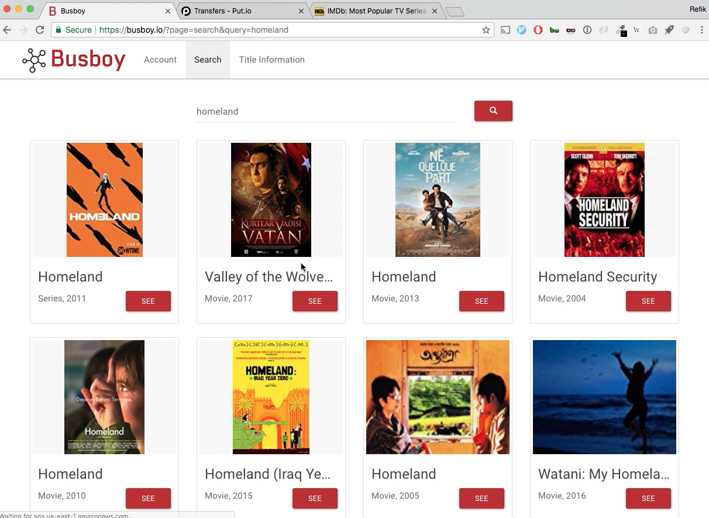
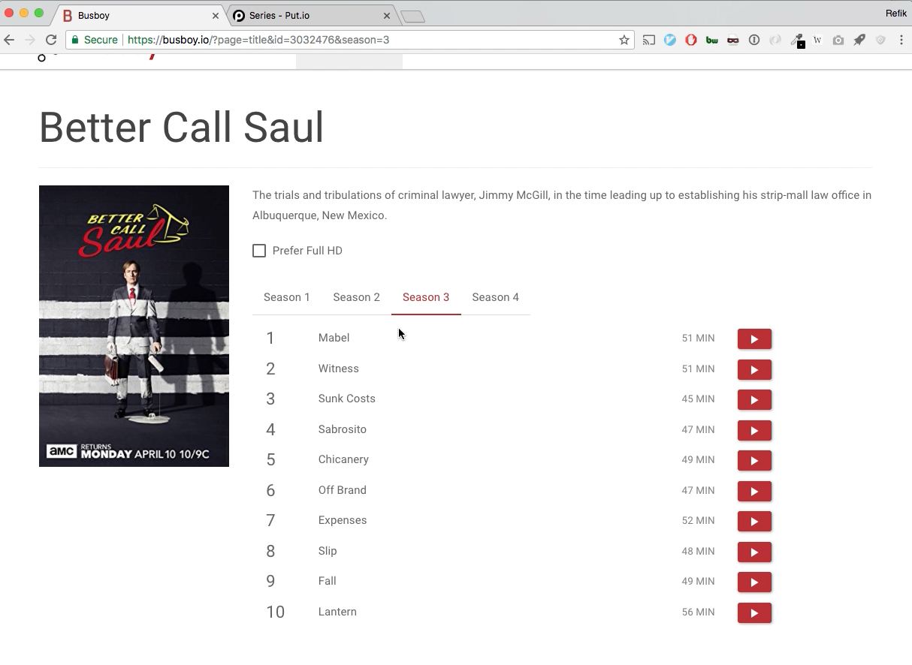
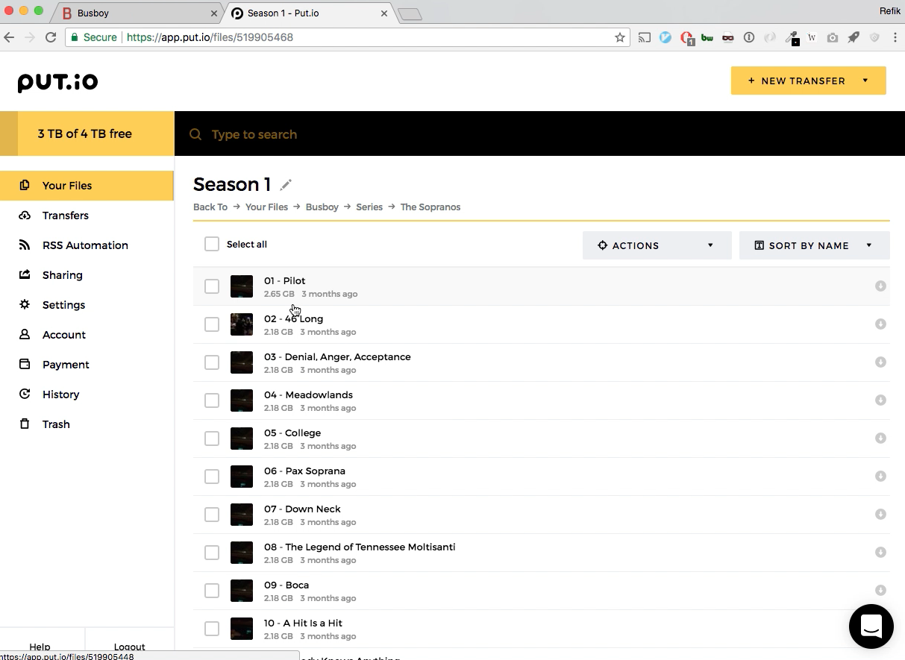
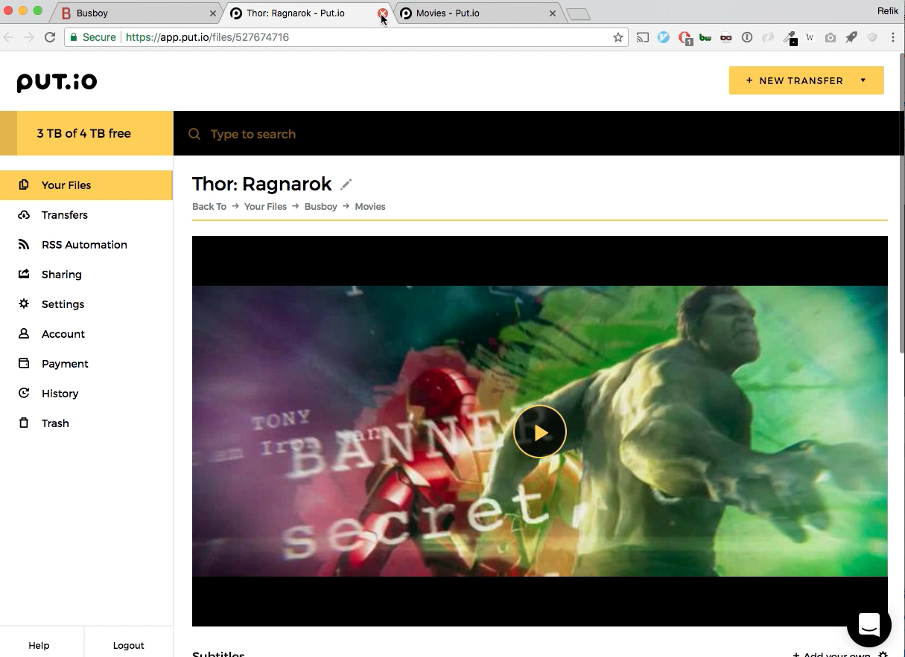

# Busboy

Busboy was a website that simplified and unified the process of:

* Finding the torrent of something you want to watch
* Adding it to your put.io account 
* Naming it in a sane way on put.io
* Organizing the folders for easy access on put.io

It also gave a content aware interface with posters for easy access.  
It is discontinued. You might like: [chill.institute](https://chill.institute/) 

# Screenshots

